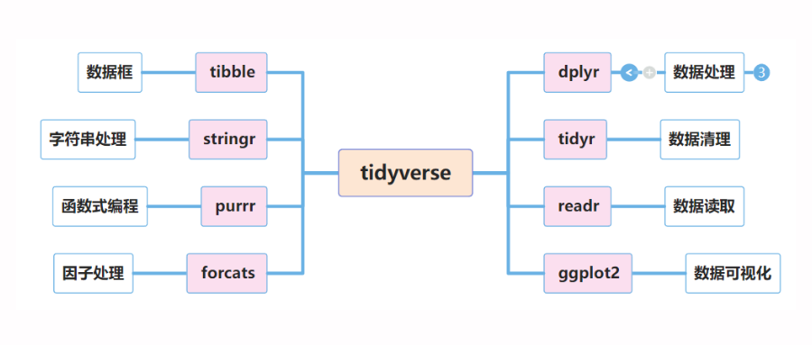

**数据整理与汇总**

# Tidyverse系统-最流行的R语言包

## 1 介绍
`tidyverse` 是一个 R 语言包套件，它包含了多个 R 包，这些 R 包都是用于进行数据清洗、分析和可视化的。`tidyverse` 包由 R 社区中的大数据科学家 Hadley Wickham 开发，旨在提供一种统一的、易于理解的语法来进行数据操作。

## 2 构成

<div style="text-align:center">
图：tidyverse系统套件包
</div>

tidyverse 包含以下几个包：  

`tibble`：用于构建数据框（data frame）的 R 包。 
dplyr：用于数据清洗、转换和操作的 R 包。  
ggplot2：用于数据可视化的 R 包。  
tidyr：用于数据整理的 R 包。  
readr：用于读取不同数据格式（如 CSV、TSV 等）的 R 包。  
purrr：用于函数式编程的 R 包。  
stringr：用于处理字符串的 R 包。  
forcats：用于处理分类数据（factor）的 R 包。 

## 3 安装
如果您想要使用 tidyverse 包，可以在 R 终端中运行以下代码来安装和加载该包：

``` R
# 安装 tidyverse 包
install.packages("tidyverse")
```
## 4 加载
tidyverse包的加载方式

要加载tidyverse包，需要在R代码中使用`library()函数`，并将包的名称作为参数传入。例如，如果要加载tidyverse包，可以使用以下代码：

``` R
# 加载tidyverse包
library(tidyverse)
```

如果您希望加载tidyverse包中的某个独立的包，例如ggplot2包，可以使用以下代码：

```
# 加载ggplot2包
library(ggplot2)
```

加载包后，您就可以使用包中的函数和数据集进行数据处理和分析。如果您想查看包中包含的函数和数据集，可以使用`ls()`函数查看。例如：

``` R
# 查看ggplot2包中包含的函数和数据集
ls("package:ggplot2")
```

通过以上方法，您就可以轻松加载tidyverse包或它的独立包，并使用包中的函数和数据集进行数据处理和分析。

## 5 特点
`tidyverse` 包的优势主要体现在几个方面：

功能丰富：`tidyverse` 包中包含了多个 R 包，每个 R 包都有着特定的功能。例如，`dplyr` 包用于数据清洗、转换和操作；`ggplot2` 包用于数据可视化；`tidyr` 包用于数据整理；`readr` 包用于读取不同数据格式，等等。
语法统一：`tidyverse` 包中的 R 包都遵循统一的语法。例如，所有的函数都使用“点号”（.）来进行组合，并且都采用类似的参数名。这样，我们就可以更容易地学习和使用这些函数。
易于理解：`tidyverse` 包中的 R 包都采用简洁、易于理解的语法。这样，我们就可以更容易地理解代码的含义，并快速地完成我们想要做的事情。


# 参考资料
1.[最流行的R语言包-Tidyverse_Shalom_r语言与可视化](https://mp.weixin.qq.com/s/IvFPmvaxPsCY1vdAbyS4uQ)


