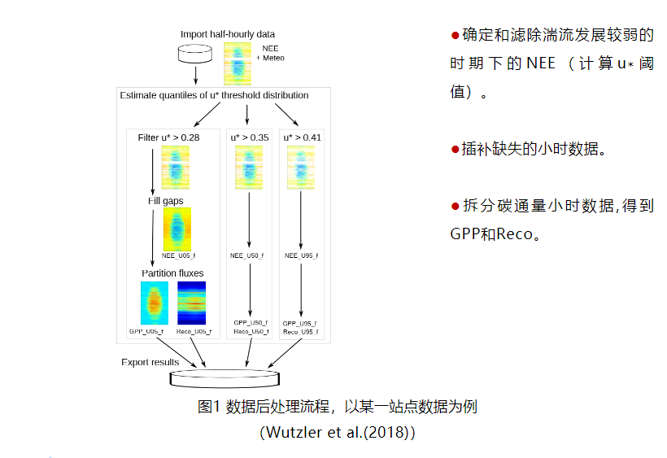
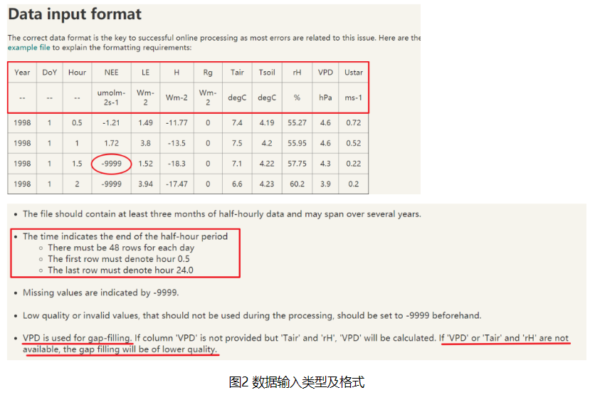
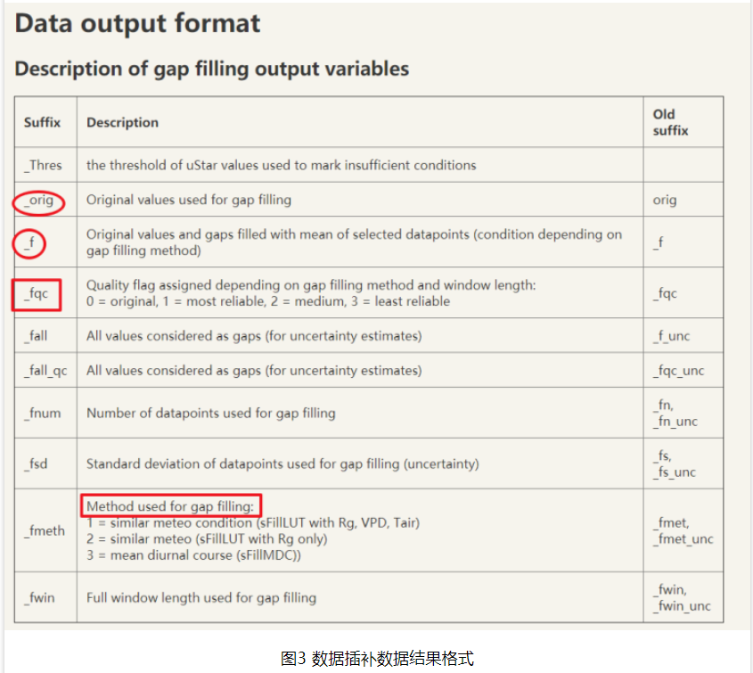
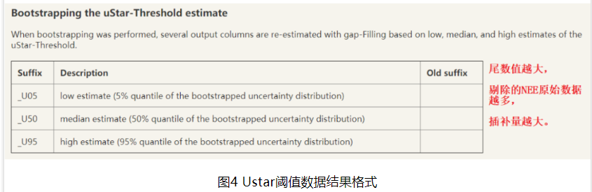
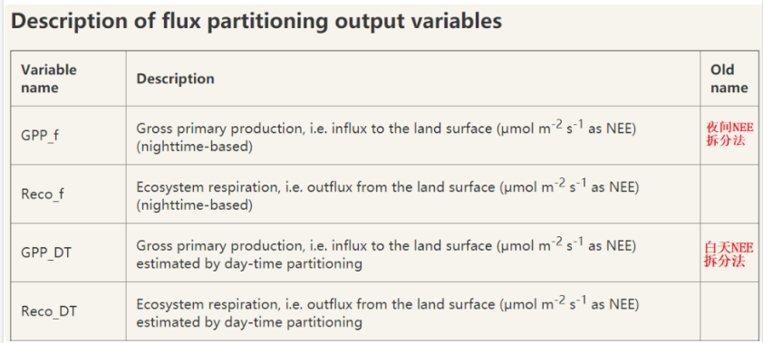
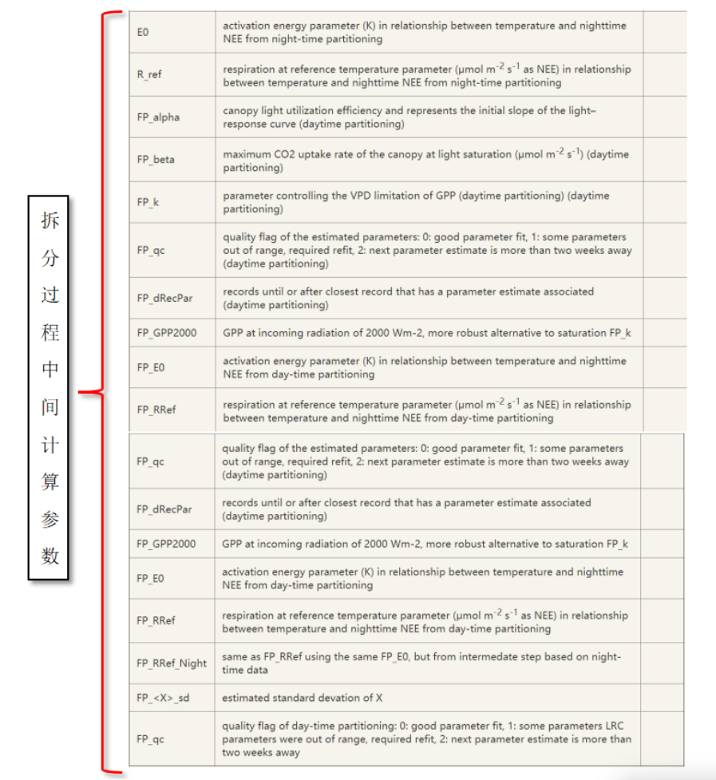

# R语言（“REddyProc”包）对涡动小时通量数据处理的方法介绍

涡动通量数据处理分为在线处理（online-processing）和后处理（post-processing）。其中在线处理针对高频通量数据（e.g.10Hz data）通过一系列标准方法进行计算，最后得到带有质量评价的低频通量数据（e.g.half-hour data），后处理主要包括Ustar阈值估计、数据插补和碳通量（NEE）拆分（植被总生产力GPP和呼吸消耗Re）及其结果的可视化表达。


当夜间大气湍流运动较弱时，摩擦风速u∗降低，涡动相关系统测量碳通量NEE时会出现低估的现象，数据漂移值增多。通常需要判断出u∗阈值，剔除这些低于u∗阈值的NEE；对缺失的数据进行插补，有利于得到完整的时间序列并得到更长时间尺度（月或年）下的均值；NEE通过主流的模型方法进行拆分，以便进一步了解研究区NEE两大组分：（1）生态系统总生产力（或总初级生产力）（2）生态系统呼吸。REddyProc 程序包通过R语言平台实现了以上三个方面的数据后处理，以及对其计算结果实现基本可视化功能。


## 1. 后处理方法介绍

数据后处理所使用的通量数据是已经过异常值剔除后的数据，NEE拆分或可插补的数据包括碳通量（NEE，umolm-2s-1）、感热通量（sensible heat flux (H) Wm-2）、潜热通量（latent heat flux (LE) Wm-2）、摩擦风速（friction velocity (u∗) ms-1）、入射短波辐射（global radiation (Rg) Wm-2）, 空气或土壤温度（air or soil temperature (Tair, Tsoil) ℃）和水汽压饱和差（vapor pressure deficit (VPD) hPa）或相对湿度（relative humidity (RH) %）。其中u∗、Rg、VPD、Tair和RH是NEE滤除、插补和拆分默认使用数据。

数据后处理主要流程包括（图 1）：



### 1.1 Ustar阈值判断（主要针对夜间NEE）

仪器所在高度处可以测量到下垫面全部碳通量（无平流损失），对应的最小u∗称为u∗阈值，u∗阈值通常出现在夜间（Rg <10 Wm-2）。由于下垫面粗糙度在不同时期（季节）发生变化，导致u∗阈值会产生季节变化。（the u∗ threshold is the minimum u∗ above which respiration reaches aplateau. This threshold is specific for each season of a site year.）。

当前REddyProc 包计算Ustar阈值方法主要有移动点法（the moving point method，MPT）和断点检测法（the breakpoint detection method，CPT），其中MPT较常用。

### 1.2 数据插补

Ustar阈值滤除NEE后，会有更多的NEE缺失数据，需要插补。


#### 1.2.1 查表法插补（LUT法）

在REddyProc包的查表法中（look-up table (LUT)），所有通量数据以特定的时间窗口内的相似气象条件为依据进行分类并计算平均值，最后得到可供参照的速查表。缺失的数据可利用同时间序列中已知的气象数据与速查表匹配，对应的通量数据即为所缺失的数据。


#### 1.2.2 平均日变化曲线法（MDC法）

该方法可在其他气象数据缺失条件下进行通量数据插补。假设植物晚上只进行呼吸作用，白天发生光合和呼吸作用，且NEE具有较为规律的日变化特征。则缺失的数据可根据临近天同时刻（或前后一小时）已知的通量数据进行插补（mean diurnal course (MDC)）。

#### 1.2.3 样本边缘分布采样法（MDS法）

边缘分布采样法（marginal distribution sampling (MDS)）结合了以上LUT和MDC两种方法，根据通量数据与气象因子之间的关系（covariation）以及通量数据在时间上的自相关进行插补。MDS可针对较大缺失范围的NEE和LE数据插补，该方法目前最受欢迎。


利用Rg, Tair和 VPD三种气象数据，（1）如果三个气象数据皆未缺失, 使用LUT 方法，三个气象因子默认边际条件（default margins）为50 Wm−2, 2.5 ◦C和5.0 hPa；（2）Tair 或VPD 缺失, 则只利用 Rg；(3) 如果三种气象数据都缺失，使用 MDC方法。另外，很多站点没有Rg的观测数据，可用光合有效辐射par代替，并设置par的边际条件（可尝试使用100-200 μmol m-2 s-1）

### 1.3 数据拆分

NEE、Reco（↑）和GPP（↓）三者关系为NEE = Reco– GPP，当前NEE拆分为Reco 和GPP主要方法有利用夜间NEE数据拆分和利用白天NEE数据拆分两种。当前夜间NEE数据拆分方法最常用。

夜间NEE数据拆分方法是假设植被呼吸Reco只与Tair变化有关，且夜间植被只进行呼吸作用，因此可以通过夜间NEE对Tair的响应变化曲线推出白天植被的呼吸Reco变化，最后根据以上关系式求出植被总生产力GPP。

白天NEE数据拆分方法是将白天NEE和总辐射的关系假设为Rg和VPD对GPP的影响以及Tair对Reco的影响的综合。


## 2 REddyProc包处理数据格式介绍

本节图片来源：
https://www.bgc-jena.mpg.de/bgi/index.php/Services/REddyProcWebDataFormat

注意虽然REddyProc包是基于该网页在线工具所开发的，但是二者的算法还有一些区别，详情参见Wutzler et al.(2018)。


### 2.1 输入需要处理数据的格式

输入数据格式如图2所示，输入文件类型为“文本文件（制表符分隔）（*.txt）”


### 2.2 输出处理完毕数据的格式

输出的数据主要包括数据插补结果（图 3），u∗阈值估计结果（图 4）和NEE拆分为GPP和Reco的结果（图 5）。






## 3 REddyProc包的R代码介绍

白色字为代码，“###”后仅为代码介绍的文本，无其他功能。“#”为跳过无需运行的代码
图片

### 3.1 准备—R程序包安装、运行、目标数据导入和调整
```     R
install packages("REddyProc") ###安装REddyProc程序包，安装一次即可
install packages("segmented") ###安装segmented程序包
library(REddyProc)            ###运行REddyProc程序包，每次重启R都要重新运行
library(segmented)            ###运行segmented程序包
library(dplyr)                ###运行其他程序包，若无dplyr,请先安装


setwd:("E:/.../..."           ###设置存放目标数据的电脑位置，
                              ###注意使用"/"或“￥￥"格式的分隔符
EddyData.F < -fLoadTXTIntoDataframe("Test data.txt")         ###载入目标文件
                                                                ###以“Test data.txt”为例
                                                                ### EddyData.F为R中的原始数据
EddyDataWithPosix.F <- fConvertTimeToPosix(EddyData.F,'YDH';
Year= 'Year',Day= 'DoY',Hour='Hour')                         ###添加R能识别的日期和时间列
EddyProc.C <-sEddyProc$new('yc1', EddyDataWithPosix.F，c("NEE","Rg"，
"Tair","VPD","Ustar"))                                         ###将涡度数据后处理所需的变量添加到sEddyProc程序
                                                            ###EddyProc.C是以下每个流程处理的数据
```


### 3.2 数据后处理

按照Ustar阈值计算，数据插补和NEE拆分三个流程分别进行处理。

#### 3.2.1 Ustar阈值计算
```     R   
###方法1

# uStarTh <- EddyProc.C$sEstUstarThold()
                            ## MPT法得出各个季节的Ustar阈值
###方法2

# uStarTh <- EddyProc.C$sESstUstarThold(ctrlUstarEst=
# usControlUstarEst(isUsingCPTSeveralT = TRUE))
                            ### CPT法得出Ustar 阈值，与MPT二选一，
###方法3

# uStarTh <- EddyProc.C$sEstUstarThresholdDistribution(nSample = 100L，probs# = c(0.05, 0.5, 0.95))
                            ###MPT法计算UsTar阈值
                            ###國值结果具有不确定性，可能对NEE滤除造成影响，
                            ###因此Ustar阈值按照其分位数，
                            ###得出三种结果分别进行NEE滤除，
                            ###以便判断最佳通量拆分结果。

#uStarTh %>%
#filter( aggregationMode == "year")%>%
#select( uStar,"5%"，"50%"，"95%")      ###得到年均 Ustar 阈值
uStarThAnnual<-usGetAnnualSeasonUStarMap(uStarTh)#[-2]
                            ###得到各个季节 Ustar 阈值各分位数结果
                            ###若运行方法 3，要将[-2]前面的'#'去掉
uStarSuffixescolnames(uStarThAnnual)[-1]
                            ###季节 Ustar 阈值各分位数，查看相关列名称
print(ustarThAnnual)        ###查看季节 Ustar 國值备分位数的结果

```

#### 3.2.2 数据插补
``` R
EddyProc.C$sMDSGapFillAfterUstar(fluxVar="NEE",uStarVar="Ustar",
                                uStarTh=uStarThAnnual,
                                uStarSuffix=uStarSuffixes,
                                FIIAII=TRUE)
                                    ###根据不同季节 UStar 阈值滤除 NEE
                                    ###不需要 Ustar 阈值分位数结果时用
                                    ###运行方法1或方法2对应使用
# EddyProc.C$sMDSGapFillAfterUStarDistr('NEE',
#                                      uStarTh=uStarThAnnual
#                                       FillAll = TRUE)
                                    ###根据不同季节 UStar 阈值滤除 NEE
                                    ###需要 Ustar 阈值分位数结果时用
                                    ###运行方法3对应使用

grep("NEE_.*_f$",names(EddyProc.C$sExportResults()), value = TRUE)
                                ###根据 Ustar 阈值结果不确定性査看 NEE 插补结果相关列名称
grep("NEE_.* fsd$",names(EddyProc.C$sExportResults()), value = TRUE)
                                ### NEE 插补数据的质量评价的列名称
EddyProc.C$sMDSGapFill('Tair',FillAll=FALSE) ### 插补 Tair，前面 NEE
                                            ###已经 FillAll=TRUE，在此设为 FLASE 即可
EddyProc.C$sMDSGapFill('VPD',FillAll=FALSE)     ### 插补 VPD
EddyProc.C$sMDSGapFi1l('Rg', FillAII=FALSE)     ### 插补 Rg
EddyProc.C$sMDSGapFi11('H',  FillAll=FALSE)     ### 插补 H
EddyProc.C$sMDSGapFi11('LE', FillAII=FALSE)     ### 插补 LE


```

#### 3.2.3 NEE拆分
```     R   

EddyProc.C$sSetLocationInfo(LatDeg=37.68,LongDeg=107.23,TimeZoneHour=8)   ### 重新设置实验区坐标(十进制)和时区，区分白天黑夜，以便进行通量拆分

resP <- lapply(uStarSuffixes,function(suffix){
EddyProc.C$sMRFluxPartition(Suffix=uStarSuffixes)
})                                   ### 夜间 NEE 数据拆分方法

# resP <- lapply(uStarSuffixes,function(suffix){
# EddyProc.C$sGLFluxPartition(Suffix=uStarSuffixes)
# })                                ### 白天 NEE 数据拆分方法


grep("GPP.*_f$|Reco",names(EddyProc.C$sExportResults(),value = T)
                                    ###根据 Ustar 阈值结果不确定性査看 NEE 拆分结果相关列名称

###结果可视化###

EddyProc.C$sPlotFingerprintY('GPP_uStar_f ',Year = 2012)
                                    ###査看 UStar 滤除 NEE 后的拆分结果热图
                                    ###以“GPP_uStar_f”为例,
                                    ###还可以做出 NEE 或 Reco 相关热图
EddyProc.C$sPlotDailySums("GPP_uStar_f") ### 存储日总量热图，
                                            ###以"GPP_uStar_f"为例
FilledEddyDataF <- EddyProc.C$sExportResults()  ###整合前面每步
                                                    ###数据处理结果

sfx <- uStarSuffixes[2]
GPPAgg <-sapply( uStarSuffixes, function(sfx){
    GPPHalfHour <- FilledEddyData.F[[paste0("GPP_",sfx,"_f")]]
    mean(GPPHalfHour, na.rm = TRUE)
})          ###计算每个 UStar 阈值下的 GPP，并将单位umolCO2 m-2 s-1换算成
            ###gCm-2 yr-1，以 Ustar 阈值的 U50 结果为例

print(GPPAgg)                       ###査看 GPP 结果
# (max(GPPAgg)-min(GPPAgg))/ median(GPPAgg)    ###计算 GPP 相对误差
                                                    ###只针对 Ustar 阈值计算的方法 3

```

#### 3.2.4 整合处理结果并输出数据

```   R

FilledEddyData.F <- EddyProc.C$sExportResults()         ###整合前面每步
                                                           ###数据处理结果
CombinedData.F   <- cbind(EddyData.F,FilledEddyData.F)  ###与原始数据
                                                            ###合并
fWriteDataframeToFile(CombinedData.F, 'Test data Results.txt'，Dir ='')
                                                         ### 输出合并后的所有结果“Test data Results.txt
```

参考资料：
1.[R语言（“REddyProc”包）对涡动小时通量数据处理的方法介绍_市场部_北京萨维福特科技有限公司](https://mp.weixin.qq.com/s/WrtzEx5bUXJLGanAY__S8w)