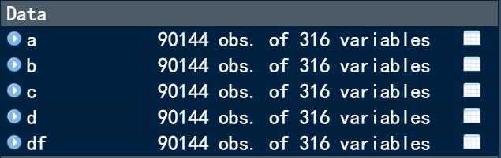
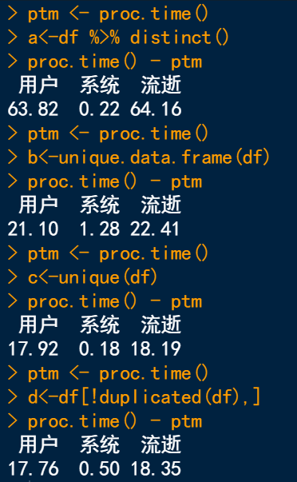
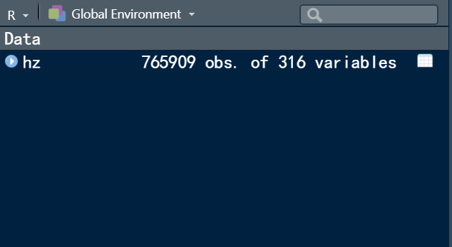
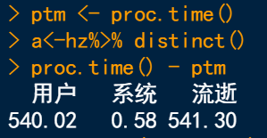
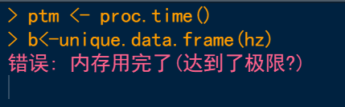
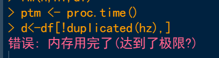

# R语言去除重复值的几种方法比较
## 开始

整理数据当中，查找和去除重复的记录是一项重要的工作。大数据集内记录的量成千上万甚至几十万上百万时，选择合适的方法就是一件很重要的事，俗话说工欲善其事必先利其器，今天我们将对R语言当中去除重复记录的几种方法进行总结，并在大数据集中测试每种函数的性能。

在语言当中去除重复记录的函数和功能有很多，就常用和我所了解的来看主要有如下几种：unique()、duplicated()，当然功能强大的tidyverse当中也提供了去重的方法。接下来我们使用一个比较大的数据集和时间测试函数来对几个功能进行比较。

首先读取数据集：

``` R
df <- read.csv('test.csv')
```

这个数据集当中总共还有超过9万行记录以及300多个变量，扫描并判断是否有重复只是一件很耗时的工作，我们接下来将主要使用4种查重的方法比较其运行时间看看是否具有差别，下面是示例代码：


## 比较结果

代码：

``` R
library(dplyr)
ptm <- proc.time()
a<-df %>% distinct()
proc.time() - ptm

ptm <- proc.time()
b<-unique.data.frame(df)
proc.time() - ptm

ptm <- proc.time()
c<-unique(df)
proc.time() - ptm

ptm <- proc.time()
d<-df[!duplicated(df),]
proc.time() – ptm
```

以下是4种查找重复记录方式的具体时间消耗。以这个9万行接近，300万个数据的表来看，似乎内置的方法效果远好于dplyr包下的函数，但是如果是这样的话，大神们费劲制作这个包又有什么样的用处呢？



接下来的测试当中我们使用了一个756000行的文件，来对以上4种去除方法进行比较。



可以看到在如此规模的数据下，dplyr包下的distinct()方法还能正常使用，只不过花了9分多钟。然而其他的几种内置方法已经不能够正常使用了，原因是数据及过大再去重操作的过程当中计算机的内存不足以支持，我的笔记本是64位系统，8G内存，可以算是目前的主流配置了，可见在处理大规模数据集时dplyr包下函数具有更加的实践意义，而在数据量较小的时候其实使用内置方法也是可以的。并没有什么明显的区别。





# 参考资料
1.[R语言去除重复值的几种方法比较_冰山烤串串_统计分析与数据挖掘](https://mp.weixin.qq.com/s/n0ZI8ldMey_g5gzHBR1Glw)