# **R语言数据预处理：缺失值的处理**

## 1 知识准备

数据分析正式开始前，我们必须首先对收集到的数据进行清理核查，这个通常被称为数据预处理（Data Preprocessing）或数据清洗（Data Cleaning）。因为现实中的收集到的数据可能有很多问题，又被称为Dirty Data。

举个例子，我们收集到的体检数据当中，由于体格检查信息为自报，收集信息的工作人员不认真不负责，以至于很多人将体重由规定的`公斤`填为了`市斤`，这就会使得后期分析当中体重、BMI等值出现错误，导致后续分析出现一连串的错误结果。

根据数据收集的方式不同，脏数据的问题五花八门，我们不打算在这里展开讲了，因为光评价数据质量几个综述都写不完。请有兴趣的小朋友去看下面列出的参考资料。
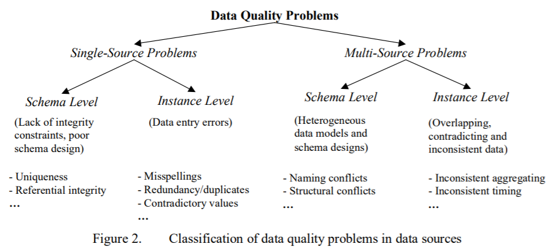


一般地，数据预处理的流程主要有：
- 数据的核对：一致性检查
- 重复值的剔除
- 缺失值的处理
- 异常值、离群值的识别处理
- 变量的变换

## 2 基本的缺失值处理方法

R语言中处理缺失值的主要方法就是删除含缺失值的变量、删除含缺失值的个案、或填补这些缺失值。我们下周再介绍缺失值的分类、检验和复杂的填补方式。本次我们先学最基本的缺失值处理方法。

R语言自带的基本函数就可以对缺失值进行基本的处理。以下是R语言中用来表示特殊意义的保留字，需要读者了解：
- NA：缺失值，意义是‘Not Available’
- NaN：无意义，如 0/0
- Inf：正无穷大，如1/0
- -Inf：负无穷大，如-1/0
- NULL：不存在

接下来我们开始学习R语言中基本的缺失值处理方法。首先是如何识别缺失值：is.na()函数，含缺失值的数据结构会用布尔值表示来。

``` R
y<-c(1,2,3,4,NA) #建立一个有缺失值的向量
is.na(y)
[1] FALSE FALSE FALSE FALSE  TRUE
```

大多数函数都有处理缺失值的的参数，含缺失值数据必须处理，不然会影响运算结果：

``` R
y<-c(1,2,3,4,NA)
sum(y) #求和会因缺失值计算失败
[1] NA
sum(y,na.rm = T) #运算前剔除缺失值
[1] 10
```
接下来我们先构造一个数据集：

``` R
name<-c("喜羊羊","美羊羊",NA,"灰太狼","红太狼")
gender<-c("M","F","M","M","F")
date<-c("4/14/2022",NA,"1/1/2020",NA,"4/1/2018")
age<-c(8,7,NA,NA,12)
test<-data.frame(name,gender,date,age)
```
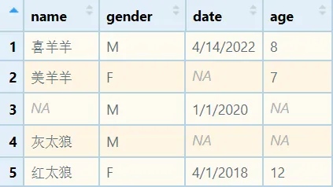

我们可以先考察一下一共有多少缺失值，当然也可以计算单个变量缺失值多少，还可以计算缺失值的比例：

```R
sum(is.na(test))
[1] 5

table(is.na(test$age))
FALSE  TRUE 
    3     2
```

na.omit()：删除含有缺失值的个案

``` R
is.na(test)
      name gender  date   age
[1,] FALSE  FALSE FALSE FALSE
[2,] FALSE  FALSE  TRUE FALSE
[3,]  TRUE  FALSE FALSE  TRUE
[4,] FALSE  FALSE  TRUE  TRUE
[5,] FALSE  FALSE FALSE FALSE

test=na.omit(test)
test
    name gender      date age
1 喜羊羊      M 4/14/2022   8
5 红太狼      F  4/1/2018  12
```

除了删除，但是我们还可以考虑填补缺失值，接下来我们重新构造这个数据集，然后把年龄中缺失的数用666换掉：

``` R
test$age[is.na(test$age)]<-666 #把NA换成666
test$age
[1]   8   7 666 666  12
```

当然，也可以使用年龄这列数的平均数、中位数、众数去换，函数必须设置na.rm = T，原因刚刚讲过。

``` R
test$age[is.na(test$age)]<-mean(test$age,na.rm = T) #这里必须设置na.rm = T
test$age
[1]  8  7  9  9 12
```

缺失的字符串也可以替换，但在这里是换不掉的，会出现以下错误：

``` R
test$name[is.na(test$name)]<-"哈居居"
Warning message:
In `[<-.factor`(`*tmp*`, is.na(test$name), value = c(4L, 3L, NA,  :
  invalid factor level, NA generated
test$name
[1] 喜羊羊 美羊羊 <NA>   灰太狼 红太狼
Levels: 红太狼 灰太狼 美羊羊 喜羊羊
```

原因是在构成数据框时没有设置参数stringsAsFactors = F，因此name被默认成了因子型变量。这有两个方案，一是重构数据框，如下所示；二是强制把name变量转换成字符型。

``` R
test<-data.frame(name,gender,date,age,stringsAsFactors = F) #方案一
test$name<-as.character(test$name) #方案二

test$name[is.na(test$name)]<-"哈居居"
test$name
[1] "喜羊羊" "美羊羊" "哈居居" "灰太狼" "红太狼"
```
## 3 缺失值的类型

要深入讲解缺失值的分析，必须首先学习缺失值的分类。根据缺失的模式是否与自身取值和其他变量的取值的关系，缺失值常被分为以下三类：

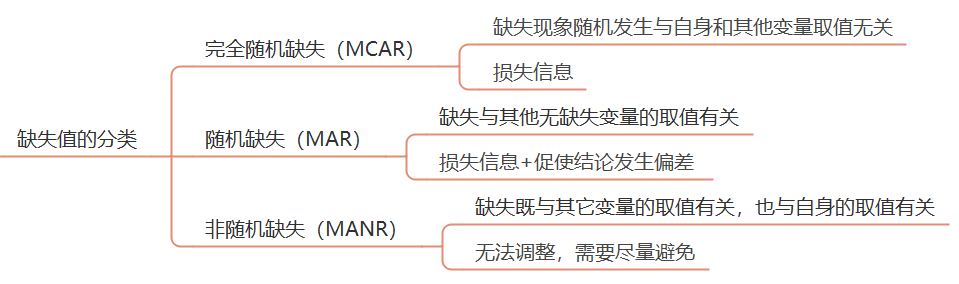

识别变量取值是否是随机缺失可以根据经验。比如一次经济调查中，由于一些灰色收入的人出于隐藏自己真实情况的目的故意不填收入，这很容易就看出来不属于随机缺失。

当然也可以使用两样本t检验判断某个变量是否是完全随机缺失。以该变量是否存在缺失值建立哑变量，并以此哑变量为分组变量，以分析的主要变量为应变量，进行两样本t检验，若应变量取值在两组差别无统计学意义就是MCAR。否则就不属于完全随机缺失。

对于MCAR或MAR，如果缺失集中在个案上，数量少于5%，一般可以直接删除个案。如果集中在变量上，也可以考虑删除该变量。如果缺失10%左右的数据，可以考虑使用多重填补方法。

MANR主要与自身取值有关，最好是重新收集数据。我们就使用经典的动物睡眠数据sleep进行演示，如果用我自己的数据将不利于读者进行复现。

## 4 描述缺失的情况

通过描述统计，看看每个变量缺失值的数量和比例：

``` R   
library(skimr) #调用skimr包
dt=VIM::sleep #用VIM包中sleep数据集做演示
skim(dt) #看看数据的情况

-- Data Summary ------------------------
                           Values
Name                       dt    
Number of rows             62    
Number of columns          10    
_______________________          
Column type frequency:           
  numeric                  10    
________________________         
Group variables            None  

-- Variable type: numeric ------------------------------------------------
# A tibble: 10 x 11
   skim_variable n_missing complete_rate   mean     sd     p0   p25   p50
 * <chr>             <int>         <dbl>  <dbl>  <dbl>  <dbl> <dbl> <dbl>
 1 BodyWgt               0         1     199.   899.    0.005  0.6   3.34
 2 BrainWgt              0         1     283.   930.    0.14   4.25 17.2 
 3 NonD                 14         0.774   8.67   3.67  2.1    6.25  8.35
 4 Dream                12         0.806   1.97   1.44  0      0.9   1.8 
 5 Sleep                 4         0.935  10.5    4.61  2.6    8.05 10.4 
 6 Span                  4         0.935  19.9   18.2   2      6.62 15.1 
 7 Gest                  4         0.935 142.   147.   12     35.8  79   
 8 Pred                  0         1       2.87   1.48  1      2     3   
 9 Exp                   0         1       2.42   1.60  1      1     2   
10 Danger                0         1       2.61   1.44  1      1     2   
      p75   p100 hist 
 *  <dbl>  <dbl> <chr>
 1  48.2   6654  ▇▁▁▁▁
 2  166    5712  ▇▁▁▁▁
 3  11     17.9  ▅▇▆▃▂
 4  2.55   6.6   ▇▇▃▁▁
 5  13.2   19.9  ▅▅▇▃▃
 6  27.8   100   ▇▃▁▁▁
 7  208.   645   ▇▃▁▁▁
 8   4       5   ▇▇▆▃▇
 9   4       5   ▇▃▁▂▃
10   4       5   ▇▆▅▅▃
```
注意，如果skimr包安不上，提示：
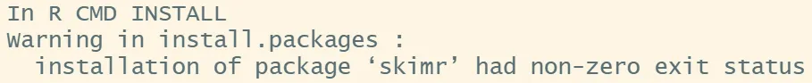
请使用句子：install.packages("skimr",type = 'binary')


查看数据集中每一列的缺失比例：

``` R
miss.prop <- function(x){sum(is.na(x))/length(x)} #编一个计算缺失值比例函数
apply(dt,2,miss.prop) #用上面的函数计算每一列
barplot(apply(dt,2,miss.prop),ylim = c(0,1),ylab = 'prop') #画个图，复习之前讲的直条图

   BodyWgt   BrainWgt       NonD      Dream      Sleep       Span 
0.00000000 0.00000000 0.22580645 0.19354839 0.06451613 0.06451613 
      Gest       Pred        Exp     Danger 
0.06451613 0.00000000 0.00000000 0.00000000
```
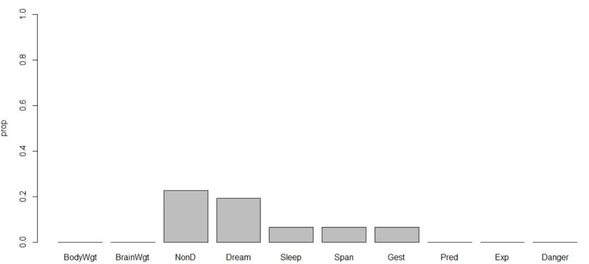

## 5 判断缺失的类型

这一步主要是通过列表、绘图、计算相关性来分析不同变量的缺失值是与自身取值有关，还是与其它变量取值有关。从而判断缺失类型是MCAR、MAR，还是MANR。

``` R
library(mice)
md.pattern(dt)

   BodyWgt BrainWgt Pred Exp Danger Sleep Span Gest Dream NonD   
42       1        1    1   1      1     1    1    1     1    1  0
9        1        1    1   1      1     1    1    1     0    0  2
3        1        1    1   1      1     1    1    0     1    1  1
2        1        1    1   1      1     1    0    1     1    1  1
1        1        1    1   1      1     1    0    1     0    0  3
1        1        1    1   1      1     1    0    0     1    1  2
2        1        1    1   1      1     0    1    1     1    0  2
2        1        1    1   1      1     0    1    1     0    0  3
         0        0    0   0      0     4    4    4    12   14 38
```

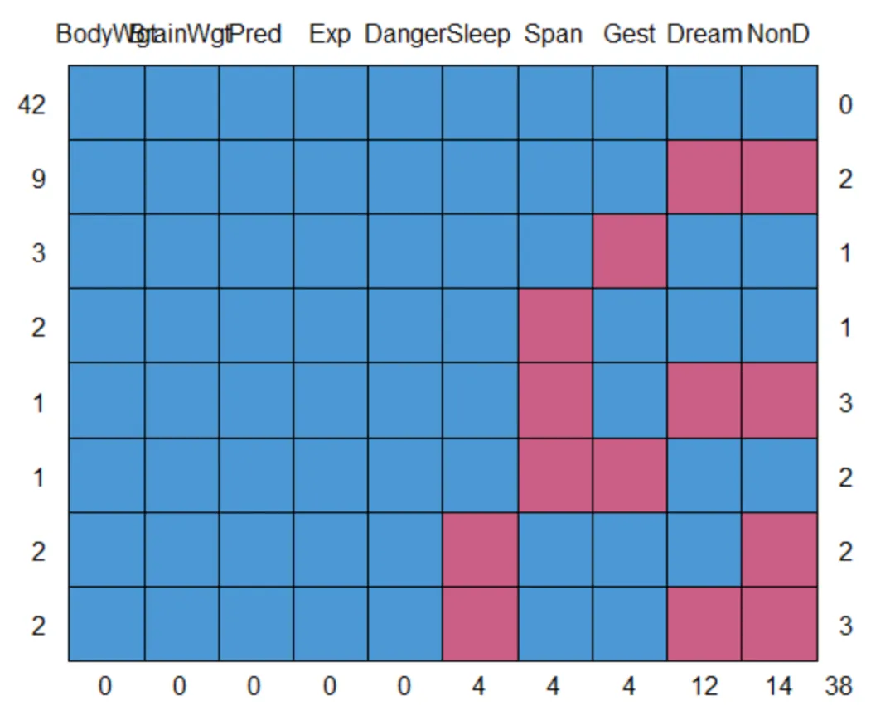

这个表和图这么解释：
- 缺失值都是集中在Sleep Span Gest Dream NonD这五个变量上
- 最左边一列数表示有42个完整个案，9个个案同时缺Dream NonD，3个个案缺Span...
- 最右边一列表示缺0个变量的个案，缺2个变量的个案，缺1个变量的个案...

接下来继续看看缺失的数量和模式：

``` R
library(VIM)
aggr(dt)
```
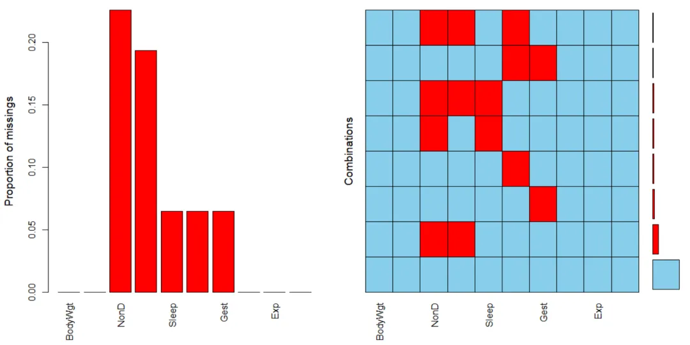

左边这个图表示每个变量缺失值的数量，右边表示各种缺失模式所占的比例。


接下来研究缺失值之间的关系：

``` R
library(VIM)
dev.new(noRStudioGD = TRUE) #关闭RStudio的绘图，要不然没法和图交互
matrixplot(dt)
```
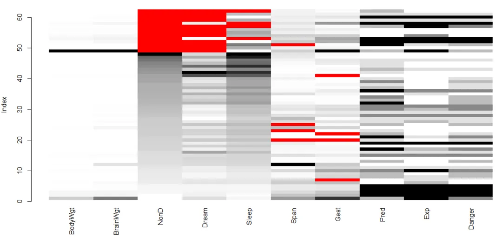

红色代表缺失值，每个变量的大小从黑到白表示，我们点击NonD列，缺失值会聚在一起，可以看到Sleep Dream NonD三个变量缺失值都是一起出现的，但是和别的变量的变化似乎没有明显的联系。

接下来研究具体两个变量之间缺失值的关系：

``` R
library(VIM)
marginplot(dt[c(4,7)]) #这个函数只接受二维数据框
```
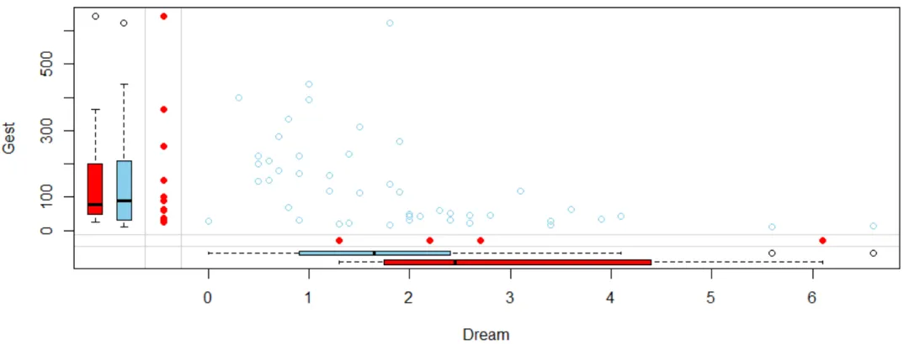

首先可以看出，Gest和Dream是负相关。以Dream变量为例，四个红点指的是Gest缺失值对应的Dream取值，淡蓝色箱图是剔除四个缺失值时Dream的分布，共58个数；红色箱图是四个缺失值对应的Dream的分布。可以看到四个Gest缺失值集中在Dream取值较高的一侧。（说明白这两个箱图就费了我不少时间图片，主要是书解释的不清楚，sleep数据共62个个案，以下就是红色箱图对应的数据）
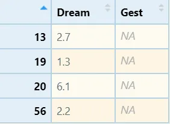

绘制A和B两个变量的marginplot图，若一个A变量的两个箱线图分布接近，可认为B的缺失与A关系不大。

进一步，我们可以绘制所有变量的两两缺失值关系矩阵，效果如下：

``` R
marginmatrix(dt)
```
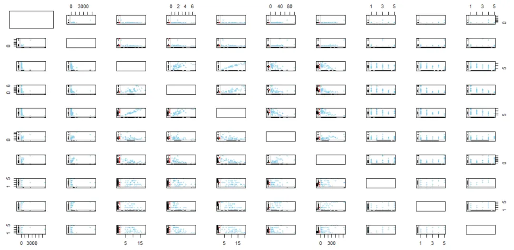

以上图看起来很困难，我们还可以制作缺失值的相关性矩阵观察缺失值间的关系：

``` R
x=as.data.frame(abs(is.na(dt))) #制作缺失值的影子矩阵
y=x[which(apply(x,2,sum)>0)] #摘出有缺失值的变量
cor(y) #计算相关性矩阵

             NonD       Dream       Sleep        Span        Gest
NonD   1.00000000  0.90711474  0.48626454  0.01519577 -0.14182716
Dream  0.90711474  1.00000000  0.20370138  0.03752394 -0.12865350
Sleep  0.48626454  0.20370138  1.00000000 -0.06896552 -0.06896552
Span   0.01519577  0.03752394 -0.06896552  1.00000000  0.19827586
Gest  -0.14182716 -0.12865350 -0.06896552  0.19827586  1.00000000
```

以上代码中，第一句x=as.data.frame(abs(is.na(dt)))是让数据转换成这样：1表示缺失，0表示存在。以上可以看出，NonD与Dream总是一起缺失。
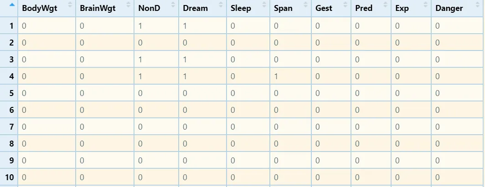

最后，再计算含缺失值变量与所有变量之间的关系：

```R
cor(dt,y,use="pairwise.complete.obs") #每对变量之间的相关性或协方差是使用对这些变量的所有完整观测值对计算

                NonD       Dream        Sleep        Span        Gest
BodyWgt   0.22682614  0.22259108  0.001684992 -0.05831706 -0.05396818
BrainWgt  0.17945923  0.16321105  0.007859438 -0.07921370 -0.07332961
NonD              NA          NA           NA -0.04314514 -0.04553485
Dream    -0.18895206          NA -0.188952059  0.11699247  0.22774685
Sleep    -0.08023157 -0.08023157           NA  0.09638044  0.03976464
Span      0.08336361  0.05981377  0.005238852          NA -0.06527277
Gest      0.20239201  0.05140232  0.159701523 -0.17495305          NA
Pred      0.04758438 -0.06834378  0.202462711  0.02313860 -0.20101655
Exp       0.24546836  0.12740768  0.260772984 -0.19291879 -0.19291879
Danger    0.06528387 -0.06724755  0.208883617 -0.06666498 -0.20443928
Warning message:
In cor(dt, y, use = "pairwise.complete.obs") : 标准差为零
```
经过以上分析，已经可以看出NonD的缺失与BodyWgt、Gest、Exp有关，肯定不算完全随机缺失。

## 总结

本次我们学习了R语言中缺失值分析的方法，从以上可以看出缺失值分析是比较复杂的，要有丰富的经验才能操作，毕竟很多时候你很难确定缺失的数据到底是怎么样的。
总的来说，识别缺失数据的数量、分布和模式都为了下一步如何处理做准备，搞清楚：
1.缺失数据的量。
2.缺失数据相关性，从而判断缺失是否随机产生。
如果没有明显的证据，一般认缺失是MCAR或MAR。

## 6 缺失值的删除和填充

处理缺失值需要首先考察缺失的类型和数量，以下由易到难介绍各种处理方法。

- 删除法：

完全随机缺失且缺失值数量不大（<5%），可以删除这些缺失值所在的个案。R语言中缺失值处理函数na.omit( )对应这种操作，又叫行删除。
如果缺失值集中在某些变量上，且该变量不是关键变量，可以考虑删除该变量。

- 简单填补法

数值变量填充用：平均数、中位数、众数
分类变量填充用：众数
不推荐该方法，会低估整体数据的变异水平。

- 复杂填补法
回归估计法：以含缺失值的变量为应变量，其它变量为自变量，先用无缺失的数据构建回归方程，再用全部数据构建回归方程，用方程的预测值作为缺失值进行迭代，直至两方程预测值基本一致。该方法会低估整体数据变异水平。

期望最大化法：主要通过EM估计。先利用已有信息求缺失数据的期望值。在假定缺失值被代替的基础上，做极大似然估计。进行迭代直至收敛，以最终缺失数据的期望值作为其估计值。

多重填补法：根据缺失值的先验分布为每个缺失值填补m个值，构造m个完整数据集，然后采用相应的完全数据分析法，对每个填补后的样本进行分析，综合m次分析结果，得到未知参数的估计。

最后，建议进行填充前和填充的重复分析，当重复分析结果差异大，应查找原因评估结果，或考虑同时报告两个结果。

下面我们重点来谈多重填补方法。
## 7 多重填补方法（MI）

我们这里介绍的多重填补法主要使用经典的mice包。mice是Multivariate Imputation by Chained Equations的缩写，该包可以估算连续、二元、无序分类和有序分类数据，同时还能生成许多诊断图来检查填补的质量。下面是关于多重填补过程的图示：
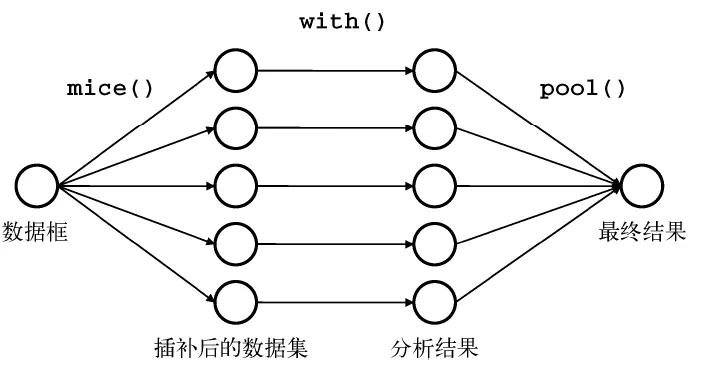

mice包的主要函数：
|函数       |含义         |
|---|---|
|mice()     |填充缺失值m次|
|with()	    |检验填好的数据集|
|pool()	    |参数估计|
|complete()	|导出填好的数据|
|ampute()	|生成缺失数据|
mice包的多重填补的过程分为3步：缺失值估计→效果检验→结果整合。我们重点介绍一下填充函数mice( )的参数：

``` R
mice(
  data, #数据
  m = 5, #构建数据集的数量，默认5
  method = NULL, #指定数据中每一列的插补方法
  visitSequence = NULL, #指定采样器一次迭代期间输入的块。属于同一块的所有变量都被估算。
  defaultMethod = c("pmm", "logreg", "polyreg", "polr"), #默认填充方法
  maxit = 5, #迭代次数，数字越大出结果越慢
  printFlag = TRUE, #是不是输出计算过程
  seed = NA, #指定这个你才能复现填充额结果
  ...
)
```

mice包能通过对填充方法的设置实现多种填充方法，包括随机森林、lasso回归，贝叶斯方法等等，详见mice包的官方文档。

## 8 实际操作

我们还是使用上一次用过VIM包中的sleep数据演示：

``` R
dt=VIM::sleep #调用VIM包中的sleep数据集
DataExplorer::plot_missing(dt) #绘制缺失值的比例
```
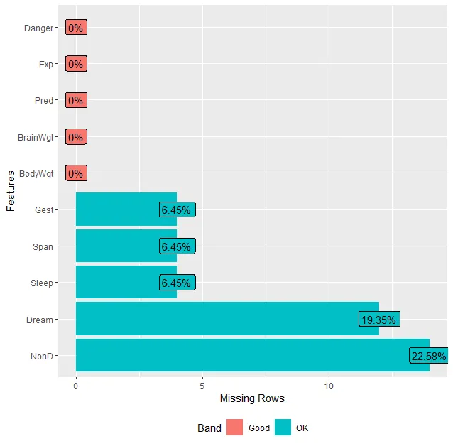

``` R
library(mice)
imp=mice(dt,seed=2022) #设置种子为2022，才能复现相同的结果
fit=with(imp,lm(Dream~Span+Gest)) #with()函数指定对每个完整数据指定的模型
#lm(Dream~Span+Gest)指定应用线性回归模型填充，Dream是因变量，Span和Gest是自变量
pooled=pool(fit) #pool()函数将5个分析结果整合为一组结果，并用最终模型的标准误和p值反映由于缺失值和多重插补而产生的不确定性
summary(pooled) #展示填充后Span+Gest与Dream的回归模型参数

         term     estimate   std.error  statistic       df      p.value
1 (Intercept)  2.535499874 0.245865749 10.3125380 53.92803 2.309264e-14
2        Span -0.007824392 0.011971699 -0.6535741 44.59539 5.167422e-01
3        Gest -0.003503465 0.001519451 -2.3057440 39.60264 2.644456e-02
```

这里Span的P值>0.05，Gest的P值<0.05，提示控制Gest时，Span与Dream无显著性关联。
下面这三个句子都可以展示具体的填充细节，我就不把运行结果列上了：

``` R
imp #运行这一句可以显示填充的具体情况，包括填充方法，预测矩阵
imp$imp$NonD #这一句展示具体的填充值
complete(imp,2) #这一句将输出m个填好的数据集当中的第二个
```

以上我们展示了使用R语言中的mice包进行多重填补的方法和过程。因为填充过程涉及运算，所以数据集越大，耗时越多。

mice包的用法关键在于设置不同的填充方法进行填充，以下我们展示一部分方法的名称、适用情况和计算方法：
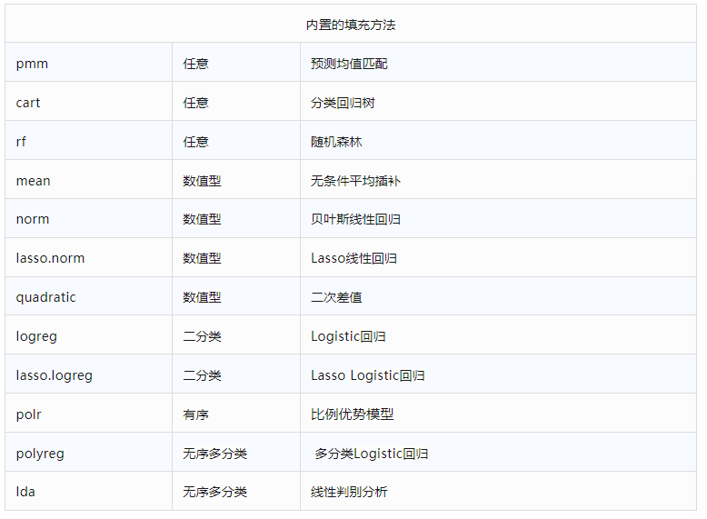

## 总结一下

除mice包以外，R语言能处理缺失值的包非常多。《R语言实战》这本书介绍了不下10个应对各种模型和情况下的缺失值处理包。不过仅mice这一个包的内置方法之多，也足够我们日常学习使用了。


# 参考资料

1.[R语言数据预处理：缺失值的处理（上）_冰山烤串串_统计分析与数据挖掘](https://mp.weixin.qq.com/s/hD6NunVdiIbi-QT4SVMDww)
2.[R语言数据预处理：缺失值的处理（中）_冰山烤串串_统计分析与数据挖掘](https://mp.weixin.qq.com/s/UQLhIUV12U1ryQtyv4uluw)
3.[R语言数据预处理：缺失值的处理（下）_冰山烤串串_统计分析与数据挖掘](https://mp.weixin.qq.com/s/pr723N71Hq57HGfndZc1tA)