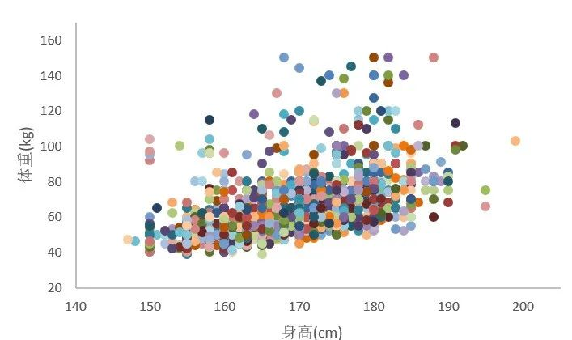

# R语言数据预处理：异常值的处理
## 0 开始

首先我们来看一个例子：

在我们最近做的一项横断面调查中，由于调查员工作时不认真，没有严格按照培训的要求监督问卷填写过程，结果收上来的数据有很多被调查者将体重的单位由`公斤`看成了`市斤`，结果中出现了很离谱的值。

如一个同学身高1米9，体重200斤左右可能是真实的，但一个同学身高1米5，体重也超过200斤，这显然就有点离谱了。更不用说我们这些数据出现了很多280斤甚至超过300斤的体重数据。

如果用这样的数据进行分析写文章，我们调查的学校将会成为全国胖胖最集中的地方，这种调查结果必然会成为别人的笑柄。由此产生一个很现实的问题是，我们如何去甄别这里谁填错了，而谁没填错呢？
## 1 概念
离群值也叫异常值，在数据分析当中对结果会起到很大的干扰。
调查或实验研究当中产生离谱的值是很常见的，不同的书或分析过程中对这样的值叫法不同。我们以《R语言实战》这本书当中为例，将这样的值通称为异常值。

异常值分为三类，分别是：离群值、高杠杆值、强影响点。

- 离群值：明显偏离该变量集中趋势的点。

- 高杠杆值：与其他变量有关的离群点，在回归建模中这个其他变量主要指的是自变量。

- 强影响点：对产生结果的建模结果产生明显影响的点，剔除该点前后模型差别明显。

看明白关键之处了吗？第一种情况的异常值只针对于变量自身而言，第二种需要探讨该变量和其他变量的关系，最后一种需要在进行相关或回归分析时才有明显体现。我个人认为没必要刻意的去区分这些概念，因为问题的实质在于你分析的场景。其实统计分析最为核心的就是考察变量之间的联系。

## 2 异常值的识别

识别异常值，无非图示法和计算检验法两大类。  
图示法有直方图，箱式图，Q-Q图、散点图，3D散点图等。  
计算检验法包括参考值范围、拉依达准则、Q检验、格拉布斯法(Grubbs)检验、狄克逊(Dixon)检验、Cook距离、马氏距离等等。以后教程更新的时候，我还会补充介绍更多的方法。  
这方法分别适用于上述三种场景下的离群值鉴别，下周的推送中我们先从比较简单的单变量异常值，也就是通常所说的离群值开始研究，利用R语言的一些函数来分析处理这些异常值。
## 3 异常值的处理

异常值的处理要十分谨慎。产生异常值既有可能是由于实验操作不当，产生了错误结果和读数，也有可能是其中蕴藏了一些新的有趣的东西，而这往往是新科学发现的重要来源。所以处理异常值是十分有趣的工作，需要按照一些步骤进行。

判断异常值的产生原因
首先必须搞清楚异常值的产生原因。第一种情况：异常值是由于实验操作不当，或观测、记录、计算错误导致的。这类异常值与样本中其余观测值不属于同一总体。就如我们这次横调面调查，对数据稍加分析很容易推测出是受试者把单位看错了。
第二种情况：异常值不是弄错了，而是真实存在的固有的。比如调查时同学中有个姚明，这种场景就属于研究中需要重点讨论的内容了。

删除

对于明显错误的值，可以在鉴别出来之后删除，然后按我们上几期提出的缺失值的处理方法进行处理：R语言数据预处理：缺失值的处理（上）、R语言数据预处理：缺失值的处理（中）、R语言数据预处理：缺失值的处理（下）。

变量变换

对存在异常值的数据集进行对数变换、logit变换、Box-Cox变换。其原理在于变换后数据的分布发生了改变，从而在不改变原有数据的相对大小的基础上改变了数值之间的相对距离。详见我们之前的推送：数据预处理中的变量变换。

增删变量
如果存在异常值的变量不太重要，可以删除了事。此外还可以增加或丢掉存在别的变量来改善存在异常值的变量，特别是在建模过程中。这听起来很玄幻？其中的关键在于尝试将存在异常值的变量与其他变量建立联系，或转换成其他变量进行处理。我准备用以上数据举例：在不太好直接鉴别体重异常值的情况下，我们尝试用身高和体重变量结合生成新变量BMI，用BMI的参考值范围来剔除荒唐的值。

稳健回归
使用对异常值耐受性强的分析方法，如Theil Sen回归，RANSAC回归，Huber回归，这些方法我也不熟，等我学明白以后再择机推送图片

总结一下

本次我们开始了新内容：异常值的识别与处理。第一篇推送我先介绍了一大堆理论知识，并反复暗示给你：研究变量间的关系是处理异常值的关键，下次我们将进行实战——使用R语言进行异常值分析。本文不设置付费了，有心人自己看着给吧。最近有公司联系我们写书，不知道是不是坑，有了解的可以给我们一点建议。

R语言数据预处理：异常值的处理（中）
原创 冰山烤串串 统计分析与数据挖掘 2022-05-13 16:00

“继上周分享了异常值的定义、分类和处理原则之后，本次我们介绍了如何在单变量场景下识别和分析异常值的方法和R语言代码。”
概述

上周的推送中概述了异常值的分类、识别和处理原则。详见：R语言数据预处理：异常值的处理（上）

异常值的检测和处理依赖于分析者对数据的了解和经验。首先要去判断异常值产生的原因，看看是异常值的产生是由于错误，还是具有意义的值，再选择合适的处理方案。接下来我们开始研究如何使用R语言处理异常值。根据上周所说的内容，我们将从单一变量，变量间关系，其它方式三个角度探讨异常值的识别和处理。

单变量异常值

这里的单变量指的依靠异常值所在变量的自身信息去分析和处理这些值。为了方便粉丝们复现和练习，我们使用了R自带的数据集，这一步我们只研究体重这个变量，并且没有考虑该变量的性别分组。

首先进行描述分析，可以看到这里最小体重是39kg，最大是166kg，根据常识，如果个别体重数据出现几公斤，或是几百上千公斤一般是错的，可以考虑直接剔除。

data(package = .packages(all.available = TRUE)) #展示所有R包自带的数据集
dt=carData::Davis$weight #挑了一个身高体重的数据集，谁都能看懂
summary(dt) #先做简单描述

   Min. 1st Qu.  Median    Mean 3rd Qu.    Max. 
   39.0    55.0    63.0    65.8    74.0   166.0
然后画个直方图看看（图不会画看之前的教程：R语言基础绘图（一）直条图、直方图、箱式图）

hist(dt,breaks=20) #设置20个条
图片

这么一来谁是异常值一看就清楚了，如果变量一般近似正态分布，可以使用拉依达准则（3σ准则）把超过偏离均数三倍标准差的值认定为异常值：

mean(dt)-3*sd(dt) #计算下限
[1] 20.51497
mean(dt)+3*sd(dt) #计算上限
[1] 111.085
dt[which(dt>111.085)] #没有小于下限的数据，只有两个数高于上限，把它们找出来
[1] 166 119
找到的异常值在检查之后可以选择保留，也可以删除，按之前介绍的缺失值处理。这里我们使用盖帽法处理。盖帽法通常使用百分位数P1或P99替换掉在这两端之外的数。当然这个替换的值可以修改。
#盖帽法
u=quantile(dt,0.99)
l=quantile(dt,0.01)

dt[dt<l]<-l #小于P1的数都被P1替换
dt[dt>u]<-u #大于P99的数都被P99替换

除了直方图，箱式图也是处理数值变量异常值的利器：
boxplot(dt) #这个输出箱式图
boxplot.stats(dt) #这个函数不输出图，以下输出的结果
$stats
[1]  39  55  63  74 102
$n
[1] 200
$conf
[1] 60.87727 65.12273
$out #这就是箱式图输出的异常值
[1] 166 119 103

boxplot.stats(dt)$out #也可以一键输出异常值
[1] 166 119 103
这里箱式图的判定异常值的标准是：小于P25-1.5*IQR，或大于P75+1.5*IQR，可以看出偏态分布使用这个方法更好一点。

还可以使用Hampel滤波，也叫中值滤波来识别异常值：
median(dt)-3*mad(dt) #中位数减去3倍的绝对中位差
[1] 27.4176
median(dt)+3*mad(dt) #中位数加上3倍的绝对中位差
[1] 98.5824

dt[which(dt>median(dt)+3*mad(dt))] #取出大于上限的值
[1] 166 119 101 102 103
依据该方法检出的异常值有五个。
绝对中位差的实际算法是：用原数据减去中位数后得到的新数据的绝对值的中位数。但绝对中位差常用来估计标准差，估计标准差=1.4826* 绝对中位差。R语言中返回的是估计的标准差。
https://blog.csdn.net/Frank_LJiang/article/details/96728850
接下来我们继续开始当调包侠，我们安装R语言中专门处理异常值的outliers包继续分析：

install.packages('outliers')
library(outliers)

#Grubbs检验
grubbs.test(dt)

  Grubbs test for one outlier

data:  dt
G = 6.63796, U = 0.77747, p-value = 1.777e-10
alternative hypothesis: highest value 166 is an outlier
Grubbs检验和Dixon检验都是判断单个值是否是异常值的假设检验，以P<0.05为异常。Dixon检验要求的样本量是3-30，我们的数据量较多不符合要求。我截取了国标GB/T 4883-2008中对以上这两种检验的选择标准，供大家参考：

图片

为了同时检测多个异常值，我们再安一个包，进行Ronsner检验：

install.packages('EnvStats')
library(EnvStats)

rosnerTest(dt) #函数默认找3个数判断是不是离群值，也可以设置参数k=5改成测五个
$distribution #提示数据的分布情况
[1] "Normal"

$statistic
     R.1      R.2      R.3 
6.637956 4.024706 2.963181 

$sample.size
[1] 200

$parameters
k 
3 

$alpha
[1] 0.05

$crit.value
lambda.1 lambda.2 lambda.3 
3.605525 3.604019 3.602505 

$n.outliers
[1] 2

$alternative
[1] "Up to 3 observations are not\n                                 from the same Distribution."

$method
[1] "Rosner's Test for Outliers"

$data
  [1]  77  58  53  68  59  76  76  69  71  65  70 166  51  64  52  65  92  62
 [19]  76  61 119  61  65  66  54  50  63  58  39 101  71  75  79  52  68  64
 [37]  56  69  88  65  54  80  63  78  85  54  73  49  54  75  82  56  74 102
 [55]  64  65  66  73  75  57  68  71  71  78  97  60  64  64  52  80  62  66
 [73]  55  56  50  50  50  63  69  69  61  55  53  60  56  59  62  53  57  57
 [91]  70  56  84  69  88  56 103  50  52  55  55  63  47  45  62  53  52  57
[109]  64  59  84  79  55  67  76  62  83  96  75  65  78  69  68  55  67  52
[127]  47  45  68  44  62  87  56  50  83  53  64  62  90  85  66  52  53  54
[145]  64  55  55  59  70  88  57  47  47  55  48  54  69  59  58  57  51  54
[163]  53  59  56  59  63  66  96  53  76  54  61  82  62  71  60  66  81  68
[181]  80  43  82  63  70  56  60  58  76  50  88  89  59  51  62  74  83  81
[199]  90  79

$data.name
[1] "dt"

$bad.obs
[1] 0

$all.stats
  i   Mean.i     SD.i Value Obs.Num    R.i+1 lambda.i+1 Outlier
1 0 65.80000 15.09501   166      12 6.637956   3.605525    TRUE
2 1 65.29648 13.34346   119      21 4.024706   3.604019    TRUE
3 2 65.02525 12.81554   103      97 2.963181   3.602505   FALSE

attr(,"class")
[1] "gofOutlier"
可以看出该函数十分便捷，一键帮我们判断出了119、166是两个离群值。

接下来我们继续介绍另一种方法：局部异常因子分析（Local Outlier Factor, LOF）。LOF通过将一个点的局部密度与其附近的局部密度进行比较来识别异常值，如果一个点的局部密度明显的比它周围的点的密度小，那么该点就是个异常值。LOF只能用于数值型变量。

具体原理看这篇文章。
https://blog.csdn.net/wangyibo0201/article/details/51705966
总之，LOF算法会将数据转换成一些比值，

比值接近1，说明该点和其邻域点密度差不多，可能和邻域同属一簇；

比值小于1，说明该点的密度高于其邻域点密度，为密集点；

比值大于1，说明该点的密度小于其邻域点密度，该点可能是异常点。

install.packages('DMwR2') #DMwR已经过气了你是安不上的
library(DMwR2)
ot <- lofactor(dt, k=10) #k是计算局部异常因子所需要判断异常点周围的点的个数，ot就是每个数据的比值
plot(density(ot)) #绘制比值的核密度图，可画可不画
wz <- order(ot, decreasing = T)[1:3] #挑出比值最高的前五名数据作为异常值
dt[wz] #输出异常值
[1] 166 119  45
这里就找了比值最高的三个异常值。

总结一下

本次一口气介绍了好多在单变量下分析异常值的方法和工具，我个人将这些方法总结如下，仅供读者参考。

图片

本次介绍的东西又多又难，需要进行一定的练习才能掌握。下周我们将从探讨变量间关系的角度来查找和分析异常值，敬请期待。如果觉得我们的文章对你有用，请点赞，转发，谢谢。

R语言数据预处理：异常值的处理（下）
原创 冰山烤串串 统计分析与数据挖掘 2022-05-20 16:00
“继上周介绍了单变量异常值的识别后，本周我们学习多变量数据的异常值识别并对异常值处理进行总结。”
概述

本次是R语言数据预处理——异常值处理的第3篇，第1篇介绍了异常值的定义：R语言数据预处理：异常值的处理（上）。第2篇介绍了如何通过一个变量自身去鉴别异常值：R语言数据预处理：异常值的处理（中）。本讲我们来介绍如何通过变量间的关系去识别异常值。

数据分析实践当中不能孤立的看待一个变量，即需要考虑你的分析目的和主要的分析方法是什么，也需要考虑变量或数据集的实际意义，因此鉴别处理异常值是一件技巧性很强的事情。

鉴于不同分析方法中有不同的异常值识别和处理方法，我们本讲简述最常见的几种，对于未介绍到的方法和技术，我们将在后续升级异常值处理教程时或今后的其它教程中涉及到，如介绍时间序列分析、聚类分析和机器学习。
依靠变量间关系处理异常值

散点图
散点图是鉴别两个相关联的变量的简单易行的方法，如果变量A不好鉴别是否有异常值，但和它相关的变量B很好鉴别，绘制散点图能很好地解决这类问题。比如一个人体重80斤完全可能，但如果该人身高为190cm，显然有点太瘦了，可以考虑是不是登错了。下例可以看出右下角的点肯定有问题。
dt=carData::Davis
scatter.smooth(dt$weight,dt$height)
图片

如果有3个相关变量，我们还可以绘制3D散点图

scatterplot3d::scatterplot3d(dt$weight,dt$height,dt$repwt)
图片

R自带的3d散点图有点鸡肋，安装rgl包可以绘制有交互作用的3d散点图，可以很方便的从不同角度观察数据的分布情况，但是这个包不支持中文，用之前需要先把所有的变量改成英文，我自己用过觉得非常好，现在安利给各位读者。
install.packages('rgl')
library(rgl)
plot3d(dt$weight,dt$height,dt$repwt,col=rainbow(20),size=10) #注意rgl包不支持中文变量名
图片
箱式图

如果有两个变量x和y，x是分类变量而y是连续变量，可以绘制x的不同类别上y的箱线图来检测离群值。就是将某个变量根据其它变量进行不同分组，再通过箱式图发现异常值。这个操作可以多次进行，比如将体重分别按性别、按年龄组分。箱式图怎么判断异常值不再解释了，上一讲说的很详细了。
boxplot(dt$weight~dt$sex) #绘制根据性别分类的箱式图
图片

在回归分析中诊断异常值

在回归分析中，或利用回归模型有很多种方法能够诊断异常值。以下用了书上经典的美国犯罪率数据，用Population、Illiteracy、Income、Frost做自变量预测Murder。

方法一：用残差图检测
异常点或离群点通常残差非常大。一般认为标准化残差的绝对值大于2的点就是离群点。残差图我们在回归分析中会在此详细讲解，但从这四幅图已经能看出Nevada是异常值了。
dt2=as.data.frame(datasets::state.x77) #调用state.x77数据集
mod=lm(Murder~Population+Illiteracy+Income+Frost,data = dt2) #构建回归方程
par(mfrow=c(2,2)) #把4幅图整合在一个画面中
plot(mod) #绘图
图片

除了上述四幅图右上的Q-Q图，我们还可以用以下函数绘制带置信带的Q-Q图，落在置信区间外的点通常被认为是离群点，可以看到Nevada在置信带外。
car::qqPlot(mod,labels=row.names(dt2),simulate=T,main="Q-Q图")
图片

方法二：也可以使用car包中的outlierTest函数输出带P值的异常值。
car::outlierTest(mod) # 返回指定模型中影响力最大的观测值
       rstudent unadjusted p-value Bonferroni p
Nevada 3.542929         0.00095088     0.047544
方法三：用hat value，若该点的hat value大于其均值的2~3倍，就被认为是异常点。

hat.plot <- function(mod){
  p <- length(coefficients(mod))
  n <- length(fitted(mod))
  plot(hatvalues(mod))
  abline(h = c(2, 3) * p/n, col = "red", lty = 2)
  identify(1:n, hatvalues(mod), names(hatvalues(mod)))
  }
hat.plot(mod)
图片

方法四：CooK距离

Cook距离用于诊断各种回归分析中是否存在异常数据。某点的Cook距离表明从回归统计量计算中排除该点后系数发生的变化。判断的标准是Cook's D距离的值大于4/(n-k-1)。下图可见三个城市都超过了标准。

cooksd <- cooks.distance(mod)
plot(cooksd, pch="*", cex=2) #绘制Cook距离
abline(h = 4*mean(cooksd, na.rm=T), col="red")  #添加参考线
text(x=1:length(cooksd)+1, y=cooksd, labels=ifelse(cooksd>4*mean(cooksd, na.rm=T),names(cooksd),""), col="red") #添加标签
图片

还可以使用influencePlo函数把离群点，高杠杆值点，强影响点这些异常值都整合在一个图上，这其中纵坐标超过+2或小于-2的点可被认为是离群点，水平轴超过0.2或0.3的点是高杠杆点，圆圈大小与影响成比例，圆圈过大的点是对模型参数的估计造成的不成比例影响的强影响点。

car::influencePlot(mod)
                StudRes        Hat       CookD
Alaska        1.7536917 0.43247319 0.448050997
California   -0.2761492 0.34087628 0.008052956
Nevada        3.5429286 0.09508977 0.209915743
Rhode Island -2.0001631 0.04562377 0.035858963
图片

聚类
聚类分析可以用来鉴别异常值，原理是计算每个点距离该点所在类的聚类中心的距离，距离大的可以认为是异常值。以下使用K-means算法：
dt=dt[2:5] #还是使用那个身高体重的数据，但是先去掉性别那一列
dt=na.omit(dt) #去掉缺失值
rt=kmeans(dt, centers=3) #进行聚类
ct=rt$centers[rt$cluster, ] 
jl=sqrt(rowSums((dt-ct)^2)) #计算数据与簇中心的距离
outliers=order(jl, decreasing = T)[1:5] #挑选出前5个最大距离
print(dt[outliers,]) #输出异常值
   weight height repwt repht
12    166     57    56   163
21    119    180   124   178
19     76    197    75   200
29     39    157    41   153
54    102    185   107   185
除了以上介绍的几种方法，识别异常值的方法还有：DBSCAN、CBLOF、Isolation Forest等等等等，可以说是五花八门。不同学科背景的人对于不同的场景，比如机器学习，时间序列分析所使用的异常值分析方法完全不同。因此本讲只介绍了作者掌握和常用的几种方法，在将来讲到对应内容时再补充其它方法。

除本讲所介绍R包外，R语言中有很多专门处理异常值的包，如：extremevalues、mvoutlier、outliers等等。
其它判断异常值的方法和技巧

依靠专业知识处理，如参考值范围

大多数值或变量都有行业允许的参考值范围，如正常青年人听力学检查参考范围可作为临床上听力学检查判定正常与异常的参考标准。

转换成第三个变量

根据变量之间的关系生成第三个变量，再分析异常值：如体重和身高数据可以计算BMI，而BMI的合理范围很容易查到。

转换变量的类型

回归分析中，有的连续变量一般不需要直接进入模型，而是将该变量转换成等级资料纳入模型如：年龄，这时可以不对这类变量进行异常值的处理，因为在连续变量离散化/的时候异常值被自然地去掉了。

总结一下

异常值、离群值的处理方法总结如下：
不处理
适用于所使用方法对异常值耐受性强时，如稳健回归。或操作中需要对变量进行离散化、或数据转换，这样操作后异常值的影响可能自然消失，不需要专门处理。
仅删除
单变量分析时，或一元回归/相关分析时，异常值可以选择仅删除的方法。识别和删除的方法我们在上周的推送已经有了详细的介绍：R语言数据预处理：异常值的处理（中）最常见的处理方法是截尾法：删除超出变量特定百分位范围的数值。
删除后填补
多变量分析时，删除某个变量的异常值往往不行，还需要进行填补。填补方法大概有以下几种：
封顶法=缩尾法（Winsorize）=盖帽法（Capping）：将超出变量特定百分位范围的数值替换为特定百分位数值。
插值法：应用原有数据信息对离群值赋予一个合理的新值。插值法是对数据赋值的一种方法，一般指线性插值（linear interpolation ）。此外还有随机赋值、最近点赋值、均值赋值、回归赋值等等。
预测（Prediction），即通建模对删除后的值进行填补，也就是刚刚提到的回归赋值。

不同的学科和研究领域中对异常值的识别和处理方法不尽相同。一篇文章介绍在金融领域广泛使用缩尾法，而在时间序列分析中用插值法多。因此实践中因地制宜，灵活机动地采用合适的方法解决问题即可。

# 参考资料
1.[R语言数据预处理：异常值的处理（上）_冰山烤串串_统计分析与数据挖掘](https://mp.weixin.qq.com/s/HuS7zRRuJzqNLxEiwzbqyg)
2.[R语言数据预处理：异常值的处理（中）_冰山烤串串_统计分析与数据挖掘](https://mp.weixin.qq.com/s/-mfoQWoIt6YnMtAiOeuJrA)
3.[R语言数据预处理：异常值的处理（下）_冰山烤串串_统计分析与数据挖掘](https://mp.weixin.qq.com/s/aXnCZmh_z6O95WhWzLnAWA)
