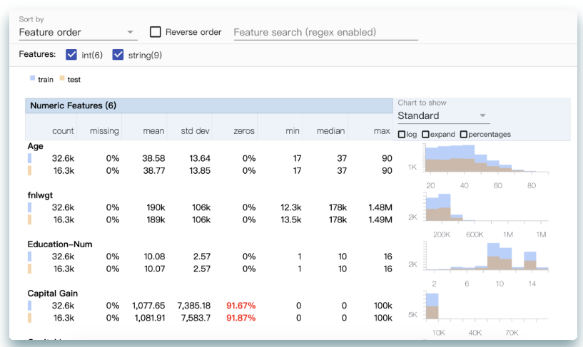
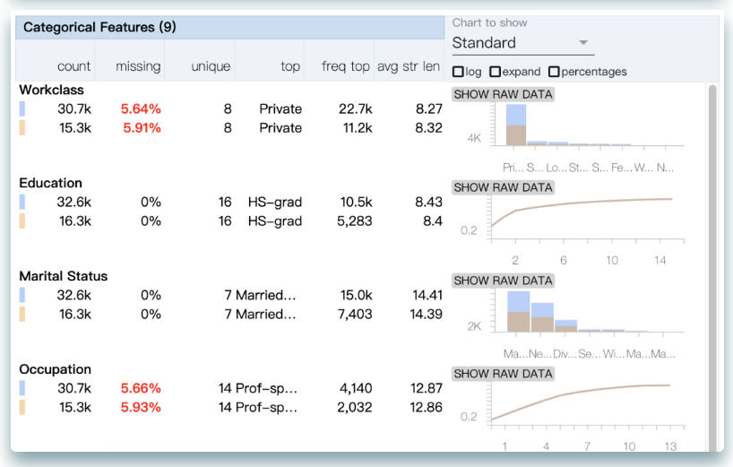
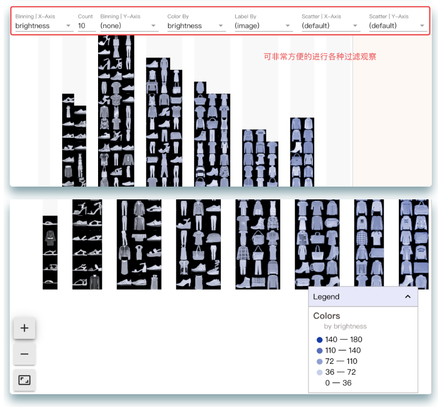

好的数据集质量，决定后续模型的上限 (Better data leads to better models)，那么怎么快速评估数据集的质量了？

本文分享的Facets，是一款由Google开源、快速评估数据集质量的神器;

Facets包含2个组件：

`facets overview`：outlier检测、数据集间各特征分布比较
`facets dive`：交互式探索某一特定数据细节。
安装
`
pip install facets-overview
facets overview
`

以一个案例简单介绍使用方法，
`
# 1、生成数据源
import pandas as pd

features = [
    "Age", "Workclass", "fnlwgt", "Education", "Education-Num",
    "Marital Status", "Occupation", "Relationship", "Race", "Sex",
    "Capital Gain", "Capital Loss", "Hours per week", "Country", "Target"
]
train_data = pd.read_csv(
    "https://archive.ics.uci.edu/ml/machine-learning-databases/adult/adult.data",
    names=features,
    sep=r'\s*,\s*',
    engine='python',
    na_values="?")
test_data = pd.read_csv(
    "https://archive.ics.uci.edu/ml/machine-learning-databases/adult/adult.test",
    names=features,
    sep=r'\s*,\s*',
    skiprows=[0],
    engine='python',
    na_values="?")

# 2、GenericFeatureStatisticsGenerator()和ProtoFromDataFrames()函数存储数据集的所有统计信息
from facets_overview.generic_feature_statistics_generator import GenericFeatureStatisticsGenerator
import base64

gfsg = GenericFeatureStatisticsGenerator()
proto = gfsg.ProtoFromDataFrames([{
    'name': 'train',
    'table': train_data
}, {
    'name': 'test',
    'table': test_data
}])
protostr = base64.b64encode(proto.SerializeToString()).decode("utf-8")

# 3、生成HTML并可视化结果
from IPython.core.display import display, HTML

HTML_TEMPLATE = """
        
        <link rel="import" href="https://raw.githubusercontent.com/PAIR-code/facets/1.0.0/facets-dist/facets-jupyter.html" >
        <facets-overview id="elem"></facets-overview>
        """
html = HTML_TEMPLATE.format(protostr=protostr)
display(HTML(html))
`
以上结果可非常方便的展示train//test数据集的偏斜情况、缺失值情况等等。

facets dive
同样以一个案例简单介绍使用方法，

import base64
import urllib.request
import os
import pandas as pd

# 数据准备
img_url = "https://storage.googleapis.com/what-if-tool-resources/misc-resources/fmnist_sprite_atlas.png"
img_name = os.path.basename(img_url)
urllib.request.urlretrieve(img_url, img_name)

df_fmnist = pd.read_csv(
    "https://storage.googleapis.com/what-if-tool-resources/misc-resources/fmnist.csv"
)
with open("fmnist_sprite_atlas.png", "rb") as image_file:
    encoded_string = base64.b64encode(image_file.read())

# 生成HTML并可视化展示
from IPython.core.display import display, HTML

jsonstr = df_fmnist.to_json(orient='records')
HTML_TEMPLATE = """
        
        <link rel="import" href="https://raw.githubusercontent.com/PAIR-code/facets/1.0.0/facets-dist/facets-jupyter.html">      
        <facets-dive id="elem" height="1000" sprite-image-width="28" sprite-image-height="28" atlas-url="data:image/png;base64,{encoded_string}"></facets-dive> #调用facets-dive 
       
        """
html = HTML_TEMPLATE.format(jsonstr=jsonstr,
                            encoded_string=encoded_string.decode("utf-8"))
display(HTML(html))
`

参考&进一步学习：https://github.com/PAIR-code/facets

原文章： https://mp.weixin.qq.com/s/fCCBo1bTP4DqW47OQLauFQ