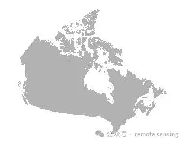
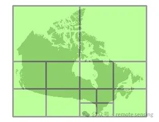
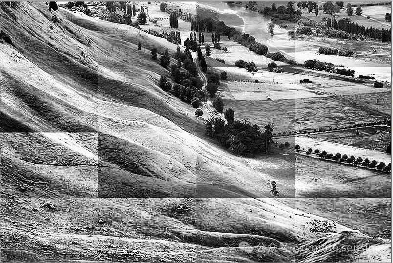

**<p align="center">遥感影像为什么需要分块处理</p>**

***

遥感影像通常具有极高的分辨率和大量的数据量，这就使得全景处理遥感影像成为一项极具挑战的任务。首要的问题是，大规模的遥感影像可能会超过硬件设备，特别是GPU的内存容量。其次，处理大规模遥感影像的计算复杂度非常高，可能会导致处理速度缓慢，效率低下。

在具体的应用中，例如深度学习的训练过程，我们通常需要将遥感影像切割成较小的样本，如512x512像素的图像块，以适应GPU的内存限制。这样的操作不仅可以有效地避免内存溢出，而且可以提高数据处理的速度，因为小图像块的处理速度通常比大图像快。

<center>


</center>

为了实现这样的分块处理，我们通常会采用双重循环的方式。首先，外层循环负责遍历图像的行，然后内层循环遍历每一行的列。这样，我们就可以逐块地访问和处理图像，而不需要一次性加载整个图像到内存中。这种方法既节省了硬件资源，又提高了数据处理的效率，对于处理大规模的遥感影像具有非常重要的意义。
<center>


</center>

代码
分块处理的核心部分如下：

``` python
# 遍历输入文件的每一个块
for x in range(0, xsize, block_ysize):
   if x + block_xsize < xsize:
       cols = block_xsize
   else:
       cols = xsize - x
   for y in range(0, ysize, block_ysize):
       if y + block_ysize < ysize:
           rows = block_ysize
       else:
           rows = ysize - y
       # 读取块的数据
       data = in_band.ReadAsArray(x, y, cols, rows)
```

以上代码的运行逻辑是：

1.该代码首先通过外层循环遍历图像的列（x轴），并且每次遍历的步长是block_xsize。这意味着图像被分割成了宽度为block_xsize的垂直条带。

2.对于每个垂直条带，如果条带的右边界超过了图像的宽度，那么就将条带的宽度设置为从当前位置到图像右边界的距离，否则就使用block_xsize作为条带的宽度。

3.然后，内层循环遍历当前垂直条带的行（y轴），并且每次遍历的步长是block_ysize。这意味着垂直条带被进一步分割成了大小为block_xsizexblock_ysize的块。

4.对于每个块，如果块的下边界超过了图像的高度，那么就将块的高度设置为从当前位置到图像下边界的距离，否则就使用block_ysize作为块的高度。

5.最后，使用ReadAsArray函数读取当前块的数据。这个函数的参数是块的左上角坐标（x,y）和块的大小（cols,rows），返回的是一个二维数组，包含了块内的所有像素值。


我们具体的例子，进一步展示分块处理，以下是我们的Python函数：

``` python
import os
import numpy as np
from osgeo import gdal

# 改变当前工作目录到包含输入文件的文件夹
os.chdir(r'D:\data1\\dem')

# 打开输入的DEM文件
in_ds = gdal.Open('gt30w.tif')
# 获取第一波段的数据
in_band = in_ds.GetRasterBand(1)
# 获取栅格的大小（行数和列数）
xsize = in_band.XSize
ysize = in_band.YSize
# 获取波段的块大小
block_xsize, block_ysize = in_band.GetBlockSize()
# 获取无数据值
nodata = in_band.GetNoDataValue()

# 创建输出的DEM文件，设置其大小、数据类型等与输入文件相同
out_ds = in_ds.GetDriver().Create(
   'dem_feet.tif', xsize, ysize, 1, in_band.DataType)
# 设置投影和地理变换参数与输入文件相同
out_ds.SetProjection(in_ds.GetProjection())
out_ds.SetGeoTransform(in_ds.GetGeoTransform())
# 获取输出文件的第一波段
out_band = out_ds.GetRasterBand(1)

# 遍历输入文件的每一个块
for x in range(0, xsize, block_ysize):
   if x + block_xsize < xsize:
       cols = block_xsize
   else:
       cols = xsize - x
   for y in range(0, ysize, block_ysize):
       if y + block_ysize < ysize:
           rows = block_ysize
       else:
           rows = ysize - y
       # 读取块的数据
       data = in_band.ReadAsArray(x, y, cols, rows)
       # 将米转换为英尺
       data = np.where(data == nodata, nodata, data * 3.28084)
       # 写入转换后的数据到输出文件
       out_band.WriteArray(data, x, y)

# 将缓存的数据写入磁盘
out_band.FlushCache()
# 设置输出文件的无数据值
out_band.SetNoDataValue(nodata)
# 计算输出文件的统计信息
out_band.ComputeStatistics(False)
# 生成输出文件的概览图
out_ds.BuildOverviews('average', [2, 4, 8, 16, 32])
# 删除输出文件对象，关闭文件
del out_ds
这个脚本的主要部分是一个双层的循环，遍历输入文件的每一个块。对于每一个块，它先读取数据，然后将单位从米转换为英尺，然后将转换后的数据写入到输出文件。

这个过程使用了NumPy的where函数，它可以根据一个条件来选择数组的元素。在这里，它用于保留无数据值不变，而将其他的值乘以3.28084（米到英尺的转换系数）。
```


附上同款CPP代码

``` cpp
#include <iostream>
#include <string>
#include <gdal_priv.h>

int main()
{
 GDALAllRegister();

 // 打开输入的DEM文件
 GDALDataset *in_ds = (GDALDataset*) GDALOpen("D:\\data1\\dem\\gt30w.tif", GA_ReadOnly);
 if (in_ds == NULL) {
   std::cerr << "Failed to open input dataset\n";
   return 1;
}

 // 获取第一波段的数据
 GDALRasterBand *in_band = in_ds->GetRasterBand(1);
 // 获取栅格的大小（列数和行数）
 int xsize = in_band->GetXSize();
 int ysize = in_band->GetYSize();
 // 获取波段的块大小
 int block_xsize, block_ysize;
 in_band->GetBlockSize(&block_xsize, &block_ysize);
 // 获取无数据值
 int nodata;
 in_band->GetNoDataValue(&nodata);

 // 创建输出的DEM文件，设置其大小、数据类型等与输入文件相同
 GDALDataset *out_ds = in_ds->GetDriver()->Create("D:\\data1\\dem\\dem_feet.tif", xsize, ysize, 1, in_band->GetRasterDataType());
 if (out_ds == NULL) {
   std::cerr << "Failed to create output dataset\n";
   return 1;
}
 // 设置投影和地理变换参数与输入文件相同
 out_ds->SetProjection(in_ds->GetProjectionRef());
 out_ds->SetGeoTransform(in_ds->GetGeoTransform());

 // 获取输出文件的第一波段
 GDALRasterBand *out_band = out_ds->GetRasterBand(1);

 // 遍历输入文件的每一个块
 for (int x = 0; x < xsize; x += block_xsize) {
   int cols = (x + block_xsize < xsize) ? block_xsize : xsize - x;
   for (int y = 0; y < ysize; y += block_ysize) {
     int rows = (y + block_ysize < ysize) ? block_ysize : ysize - y;

     // 读取块的数据
     float *data = new float[cols * rows];
     in_band->RasterIO(GF_Read, x, y, cols, rows, data, cols, rows, GDT_Float32, 0, 0);

     // 将米转换为英尺
     for (int i = 0; i < cols * rows; i++) {
       if (data[i] != nodata) {
         data[i] *= 3.28084;
      }
    }

     // 写入转换后的数据到输出文件
     out_band->RasterIO(GF_Write, x, y, cols, rows, data, cols, rows, GDT_Float32, 0, 0);

     delete[] data;
  }
}

 // 将缓存的数据写入磁盘
 out_band->FlushCache();
 // 设置输出文件的无数据值
 out_band->SetNoDataValue(nodata);
 // 计算输出文件的统计信息
 int bApproxOK;
 out_band->ComputeStatistics(0, NULL, NULL, NULL, NULL, &bApproxOK);
 // 生成输出文件的概览图
 out_ds->BuildOverviews("AVERAGE", NULL);

 // 关闭文件
 GDALClose((GDALDatasetH) in_ds);
 GDALClose((GDALDatasetH) out_ds);

 return 0;
}
```


分块处理有没有缺陷？

其实是有的，比如，请看下图



处理数据时参数选择不一样导致块与块之间出现了明显的尾痕。

一般解决的方式就是处理局部块数据使用全局参数。


此外，问一个问题？为什么要学cpp的代码呢？因为cpp的速度比python的运行速度要快得多。python可以作为前期的技术验证，工程化落地的话还是改写为CPP更稳妥。


# 参考资料
1.[遥感影像为什么需要分块处理_十二画_remote sensing](https://mp.weixin.qq.com/s/6oKgGU-0CQ9NnRcfpfBa8Q)
